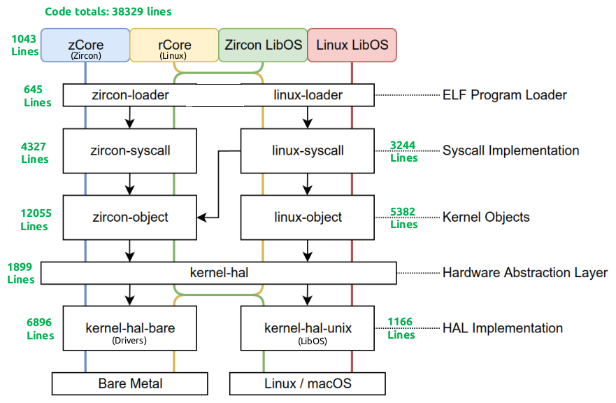
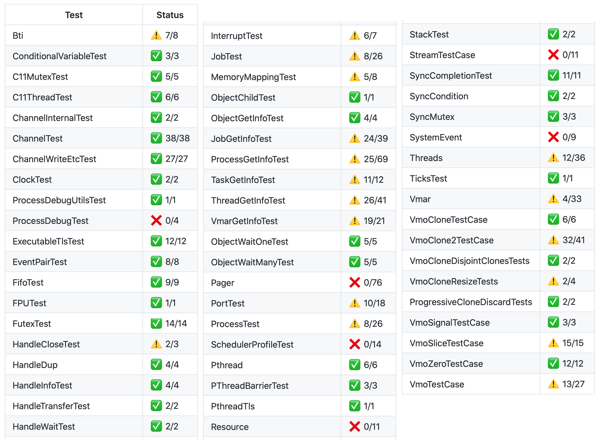
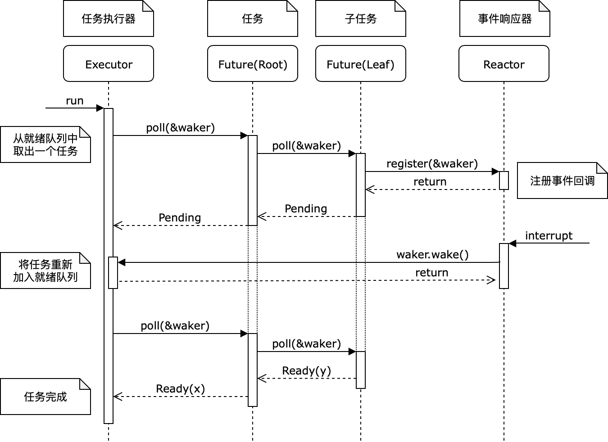
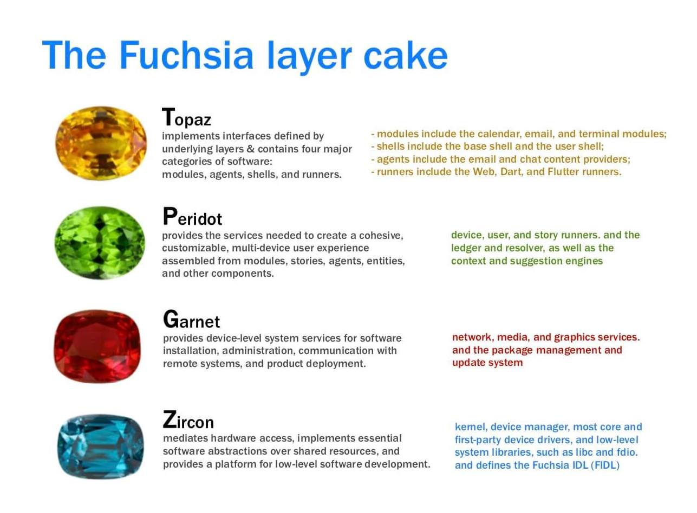
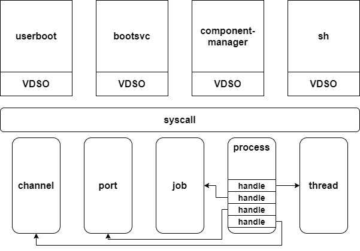
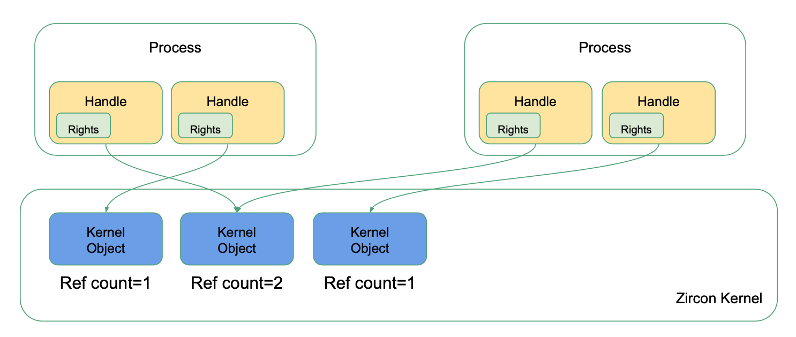
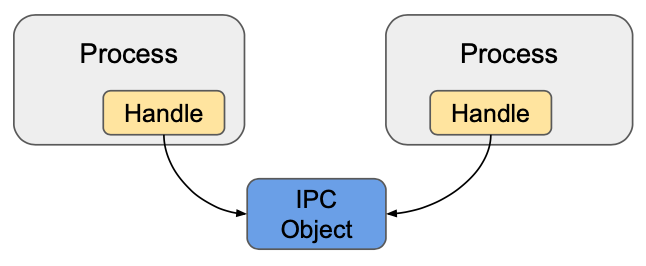
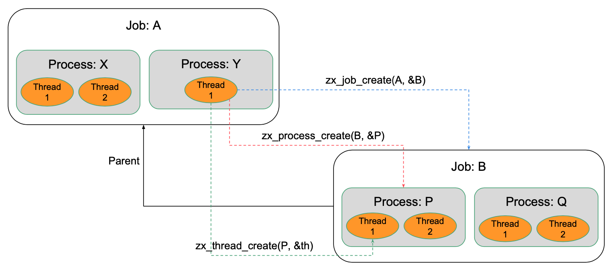
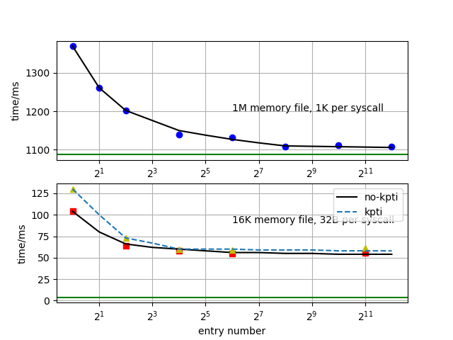
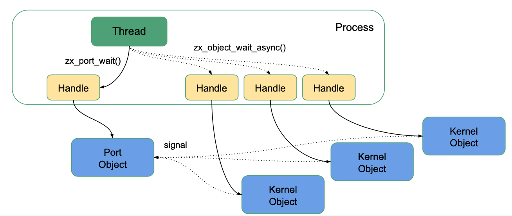

<!-- theme: gaia -->
<!-- _class: lead -->
# zCore 入门导引

张译仁

2022.3.19

---

### 提纲

- **总体介绍**
- 各模块实现

---

### 总体介绍 -- 特征
zCore: A Next Gen Rust OS
- Rust 语言编写的“混合”操作系统内核
  - 同时支持 Linux 和 Zircon 系统调用
  - 同时支持 LibOS 和 裸机 OS 形式
  - 可以完全在用户态开发、测试、运行
-  内核协程化
    -  扩展 Rust Async 机制
    - 重新思考 syscall 以及调度

---

### 总体介绍 - 项目规模
目前大约 3.8 万行左右代码量



---

### 总体介绍 -  完成度
Zircon 官方系统调用测试集


---

### 总体介绍 -  完成度


---

### 总体介绍 -  zCore架构设计文档

zCore 架构设计文档


---

* zCore 接口文档


---

### 总体介绍 -  自动测试

文档与CI/CD集成测试
- `#![deny(warnings)]`：警告报错
- cargo fmt && clippy：检查代码格式和风格
- cargo build：保证所有平台编译通过
- cargo test：用户态单元测试，报告测试覆盖率
- core-test：内核态集成测试，维护通过测例列表
- （TODO）cargo bench：性能测试

上述测试全部通过才允许合入 master

---

###  总体介绍 -  模块化
rCore OS 生态
拆成小型 no_std crate，每个专注一件事：
  - `trapframe-rs`：用户-内核态切换
  - `rcore-console`：在 Framebuffer 上显示终端
  - `naive-timer`：简单计时器
  - `executor`：单线程 Future executor
  - ……

---

### 提纲

- 总体介绍
- **各模块实现**
  - **初始化与第一个用户程序**
  - 两套 syscall 接口
  - 内核设计 -- 用户态HAL
  - 内核协程
  - 其他

---

### 初始化与第一个用户程序

* zCore: 调用 kernel-hal 接口，完成 内存 / 中断 等的初始化
* loader：加载第一个用户程序并运行

* [看代码]

---

### 提纲

- **各模块实现**
  - 初始化与第一个用户程序
  - **两套 syscall 接口**
  - 内核设计 -- 用户态HAL
  - 内核协程
  - 其他

---

### 两套 syscall 接口


* [看代码：目录结构]

---

### 两套 syscall 

* zircon 文档：https://fuchsia.dev/fuchsia-src/reference/syscalls
* zcore tutorial:  https://rcore-os.github.io/zCore-Tutorial/

* syscall 入口：[trapframe-rs](https://github.com/rcore-os/trapframe-rs/blob/master/src/arch/riscv/trap.S) / loader

---

### 提纲

- **各模块实现**
  - 初始化与第一个用户程序
  - 两套 syscall 接口
  - **内核设计 -- 用户态HAL**
  - 内核协程
  - 其他

---

### 内核设计 -- 用户态HAL
HAL 硬件抽象层的设计实现


* Mode: bare-metal  vs  **libos**
* Arch: x86-64  vs riscv
* Platform: qemu  vs  d1 

---

### 内核设计 -- 用户态HAL
需求：内核对象单元测试

- 测试对象：线程 `Thread`，内存映射 `VMO`，`VMAR`

- 但 `cargo test` 只能在开发环境用户态运行

- 思考：能否在用户态**模拟**页表和内核线程？

---

### 内核设计 -- 用户态HAL
方案：用户态模拟内核机制

- 内存映射：Unix `mmap` 系统调用

    - 用一个文件代表全部物理内存
    - 用 `mmap` 将文件的不同部分映射到用户地址空间
- log: stdin  / stdout
- 磁盘：文件

进一步思考：

* 时钟中断？
* 测试驱动 / 测试页表内容？


---

### 内核设计 -- 用户态HAL
HAL API 举例

- 内核线程：`hal_thread_spawn`
- 物理内存：`hal_pmem_{read,write}`
- 虚拟内存：`hal_pt_{map,unmap}`
- 用户态：`hal_context_run`
- 定时器：`hal_timer_{set,tick}`
- 输入输出：`hal_serial_{read,write}`
- 设备管理：`hal_irq_{enable,handle}`

* [看代码]


---

###  内核设计 -- 用户态HAL
Challenge：用户-内核态切换 🧙‍♀️
- 控制流转移：系统调用 -> 函数调用
    - `int 80` / `syscall` -> `call`
    - `iret` / `sysret` -> `ret`
    - 需要修改用户程序代码段！

- 上下文恢复：寻找 "scratch" 寄存器
    - 用户程序如何找到内核入口点？内核栈？
    - 利用线程局部存储 TLS，线程指针 fsbase

---

### 提纲

- **各模块实现**
  - 初始化与第一个用户程序
  - 两套 syscall 接口
  - 内核设计 -- 用户态HAL
  - **内核协程**
  - 其他

---

### 内核设计 -- 异步调度
```rust
fn handler(mut stream: TcpStream) -> Result<()> {
    let mut buf = [0; 1024];
    let len = stream.read(&mut buf)?; // may block
    stream.write_all(&buf[0..len]))?; // may block
}
```
协程化

```rust
// fn handler(...) -> impl Future<Output = Result<()>>
async fn handler(mut stream: TcpStream) -> Result<()> {
    let mut buf = [0; 1024];
    let len = stream.read(&mut buf).await?;
    stream.write_all(&buf[0..len])).await?;
}
```

---
### 内核设计 -- 异步调度
异步调度：底层 --> 中层 --> 上层



---


### 内核设计 -- 异步调度
底层：中断/异常事件处理：手动构造 Future
```rust
// 例：在内核对象上等待信号
struct WaitSignal {...}     // 定义一个状态机结构
impl Future for WaitSignal { // 实现 Future trait 的 poll 函数
    type Output = Signal;
    fn poll(self: Pin<&mut Self>, cx: &mut Context)
    -> Poll<Self::Output>
    {
        if self.signal().contains(signal) { // 若目标事件已发生，直接返回 Ready
            return Poll::Ready(signal);
        }

        let waker = cx.waker().clone(); // 尚未发生：注册回调函数，当事件发生时唤醒自己
        self.add_signal_callback(move || waker.wake());
        Poll::Pending
    }
}

fn wait_signal(&self, signal: Signal) -> impl Future<Output = Signal> {
    WaitSignal {...}   // 返回状态机对象
}
```

---

### 内核设计 -- 异步调度
中层：事件组合处理：用 async-await 组合 Future

```rust
async fn sys_object_wait_signal(...) -> Result {
    ...
    let signal = kobject.wait_signal(signal).await;
    ...
}
```

---

### 内核设计 -- 异步调度
中层：事件组合处理：用 async-await 组合 Future
用法：用 `select` 组合子实现 超时处理 和 异步取消

```rust
async fn sys_object_wait_signal(..., timeout) -> Result {
    ...
    let signal = select! {
        s = kobject.wait_signal(signal) => s,
        _ = delay_for(timeout) => return Err(Timeout),
        _ = cancel_token => return Err(Cancelled),
    };
    ...
}
```


---

###  内核设计 -- 异步调度
上层：异步内核函数：Executor 运行 Future
- libos：`tokio` / `async-std`，支持多线程，可以模拟多核
- bare：`rcore-os/executor`，简易单核
- [看代码：zCore/utils.rs]

---
### 提纲

- **各模块实现**
  - 初始化与第一个用户程序
  - 两套 syscall 接口
  - 内核设计 -- 用户态HAL
  - 内核协程
  - **其他**

---

### 其他

* zircon-user: 用户编译 zircon 用户程序
* linux-user ?
* [测试与运行](https://github.com/rcore-os/zCore#zcore)

---

### 附录：Zircon 内核对象

Fuchsia 和 Zircon




---

### Zircon 内核对象  -- 特点

- 实用主义微内核

- 使用 C++ 实现，支持 x86_64 和 ARM64
- 面向对象：将功能划分到内核对象
- 默认隔离：使用 Capability 进行权限管理
- 安全考量：强制地址随机化，使用 vDSO 隔离系统调用

---
### Zircon 内核对象  -- 用户执行环境



---

### Zircon 内核对象  -- 主要组成
- Everything can be KernelObject
  - 任务：Job, Process, Thread, Exception
  - 内存：VMAR, VMO, Pager, Stream
  - IPC：Channel, FIFO, Socket
  - 信号：Event, Timer, Port, Futex
  - 驱动：Resource, Interrupt, PCI ...

---

### Zircon 内核对象  -- Object

- Object：内核对象
- Rights：对象访问权限
- Handle = Object + Rights：对象句柄（类似 fd）



---

### Zircon 内核对象  -- IPC

- Channel：进程间通信基础设施，可以传递数据和 handle
- FIFO：报文数据传输
- Socket：流数据传输



---

### Zircon 内核对象  --  Tasks

- Job：作业，负责控制权限（类似容器）
- Process：进程，负责管理资源
- Thread：线程，负责调度执行



---

### Zircon 内核对象  --  MAS
Memory and Address Apace

- VMO: Virtual Memory Object
  - Paged：分页物理内存，支持写时复制
  - Physical：连续物理内存
    <!-- - 一段连续的虚拟内存，可以用于在进程之间、内核和用户空间之间共享内存
    - 在内核中被维护为类似线段树的数据结构，支持从一个VMO中创建新的VMO -->

- VMAR: Virtual Memory Address Region
    - 代表一个进程的虚拟地址空间
    - 树状结构
    <!-- - VMO可以被映射到VMAR中，默认为内核进行位置随机，或用户态指定位置但可能失败。 -->

- Pager：用户态分页机制

---

### Zircon 内核对象  --  Signaling /Waiting

每个 Object 有 32 个信号位，用户程序可以阻塞等待。

- Event (Pair)：事件源/对
- Timer：计时器
- Futex：用户态同步互斥机制
- Port：事件分发机制（类似 epoll）


---

## 附录：异步 syscall 简单测试



* allwinner nezha riscv

---

## 异步 syscall 的感知

* 如何感知异步 syscall ?

  |              | CPU占用 | Latency | Locality |     备注     |
  | :----------: | :-----: | :-----: | :------: | :----------: |
  |   syscall    |    👍    |    👍    |    😰     |              |
  |   polling    |    😰    |    👍    |    👍     | 适合高速设备 |
  | free-polling |    👍    |    😰    |    👍     |              |
  |    uintr     |    👍    |    👍    |    👍     | 需要硬件支持 |

  zCore: free-polling + uintr

---

## 可抢占协程

* 异步执行 latency 的累加
  * 用户提交 => 内核感知, 内核提交 => 用户感知 ：uintr  or  polling
  * interrupt => 内核响应：优先级，可抢占协程
* 可退化的协程 = 可抢占的协程
  * 在中断 handler 里新建一个线程 
  * 协程的线程间迁移

---

## 协程的调度

* 协程的类型
  * 内核协程：处理异步 syscall 的协程，polling 协程等
  * 用户协程：用户线程封装而成
* 核专用化
  * 内核核：内核协程，切换次数多，切换开销小
  * 用户核：用户协程，切换考校大，切换次数少
  * 如果更进一步：磁盘 IO 核，网络核
* 问题：load balance


---
## 协程切换开销

* thread switch  =>  function return and call
* lmbench lat-ctx

```shell
Context switching - times in microseconds - smaller is better
-------------------------------------------------------------------------
Host                 OS  2p/0K 2p/16K 2p/64K 8p/16K 8p/64K 16p/16K 16p/64K
--------- ------------- ------ ------ ------ ------ ------ ------- -------
proc switch             0.3900 0.8800 0.8900 1.9200 2.2700 2.11000 2.25000
coroutine switch        0.0330 0.0390 0.0390 0.0600 0.0600 0.06800 0.06800
```
### Zircon 内核对象  --  Signaling /Waiting

每个 Object 有 32 个信号位，用户程序可以阻塞等待。



---
<!-- theme: gaia -->
<!-- _class: lead -->
# 谢谢

